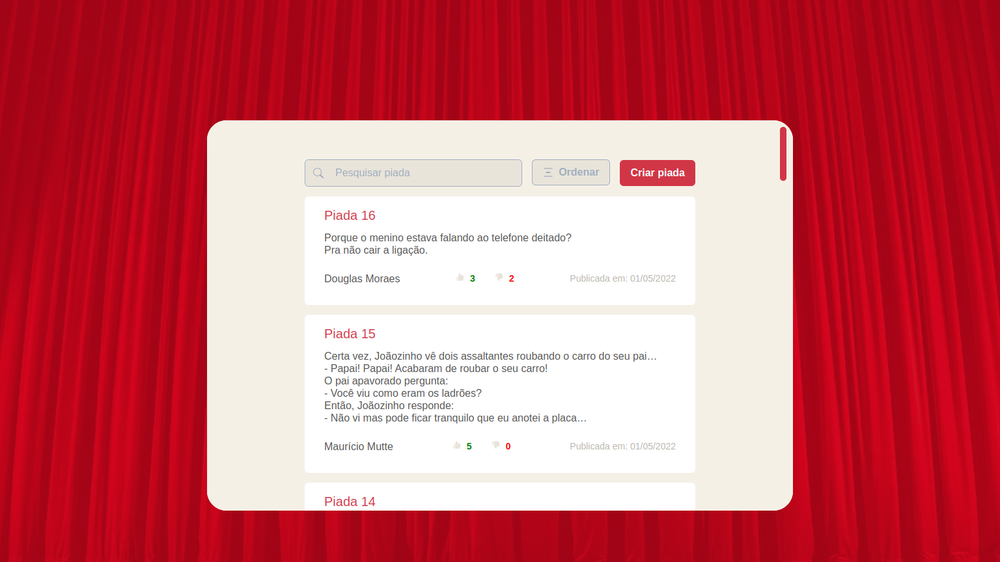

# Só piada boa


Só piada boa is a better place to you find the better jokes to tell to your friends and have nice moments!

## Screenshot


## Steps to run the project
### Clone
```
git clone git@github.com:RobertDS07/so_piada_boa.git
```
### Install dependencies
```
yarn
```
### Create .env
To create this file just clone .env.example of root and replace that name to .env
### Run the server
```
yarn start:server
```
### Run the project (in another cmd)
```
yarn build

yarn start
```

Now just go to http://localhost:3000
